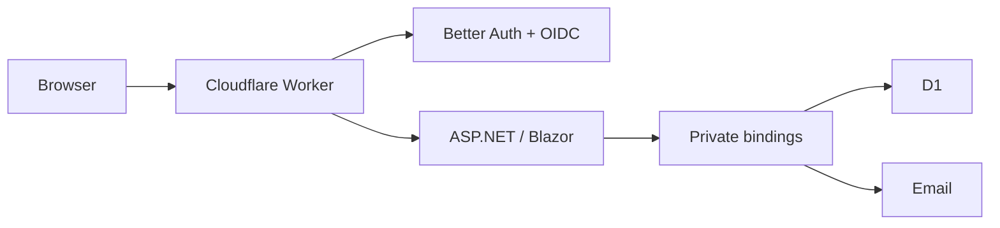

# Flarestack

Flarestack runs .NET 10 Blazor applications on Cloudflare Containers, with D1,
Better Auth OIDC and email behind private Worker bindings. Develop with .NET
Aspire, including application and infrastructure logs, distributed traces and a
local email inbox. Alchemy owns Cloudflare provisioning and migrations.

## Preview status

The supported installation currently uses local-packed artifacts; NuGet/npm
registry packages are not published. A prior Todo cloud preview verified live
email and was removed. The generated-project deployment pipeline is under
acceptance validation; see [validation](docs/validation.md) for actual evidence.
Do not treat this preview as production-ready.

## Create and run

Prerequisites: .NET SDK **10.0.401**, Bun **1.4.2**, and Aspire CLI **13.5.3**.
Docker is required for Container mode and deployment. Install Aspire with
`dotnet tool install --global Aspire.Cli --version 13.5.3`.

Once you have the packed template (see [contributing](CONTRIBUTING.md)):

```sh
dotnet new install ./Flarestack.Templates.0.1.0-local.2.nupkg
dotnet new flarestack-blazor -n Notes
cd Notes
bun install
aspire run
```

Open the app and **inbox** endpoints in Aspire to register, verify email and sign
in. Fast mode uses .NET hot reload. To switch to Alchemy's container mode:

```sh
aspire stop
bun run dev:container
```

The template includes its preview packages, so an application can live outside
this repository. Registry releases must remove that packaging workaround and the
pinned Alchemy patches before becoming the supported installation path.

## Deploy

Start Docker and authenticate using `bunx alchemy profile edit --add cloudflare`
inside `infra`. Review the non-secret `deployment.json`, then:

```sh
aspire deploy --environment staging
```

Stages are explicitly named `staging` or `production`; repeated deployment updates
the same stage. Alchemy creates the auth secret in encrypted state. The runner
checks health and OIDC before reporting success. Resources incur Cloudflare charges.
See [deployment](docs/deployment.md) for CI credentials, domain/email setup and
separate confirmed teardown.

## Included

- Blazor Interactive Auto Todo pages; server-side account/admin pages.
- Fast and Container local modes, Aspire logs/traces and D1 query spans.
- Private versioned D1, authentication and email bindings.
- Email verification/recovery, OIDC, live session checks and user administration.
- Owner-scoped repositories and cross-user isolation tests.
- Packed-template acceptance tests and a Linux/Windows CI workflow.



The default is one container. ASP.NET Data Protection keys are currently ephemeral;
replacement can require a fresh sign-in. Production deployment requires explicitly
acknowledging that limitation. Multi-instance Blazor and general social-provider
coverage remain deferred. Windows coverage is configured, not yet claimed as passed.

## Learn more

[Public APIs](docs/public-api.md) · [API migration](docs/api-migration.md) ·
[Database ownership](docs/database.md) · [Security model](docs/security-model.md) ·
[Accounts and email](docs/accounts-and-email.md) · [Rendering](docs/interactive-auto.md) ·
[Deployment](docs/deployment.md) · [Infrastructure extensions](docs/infrastructure.md) · [Compatibility](docs/compatibility.md) ·
[Contributing](CONTRIBUTING.md) · [Security reporting](SECURITY.md)

Licensed under the [MIT License](LICENSE).
