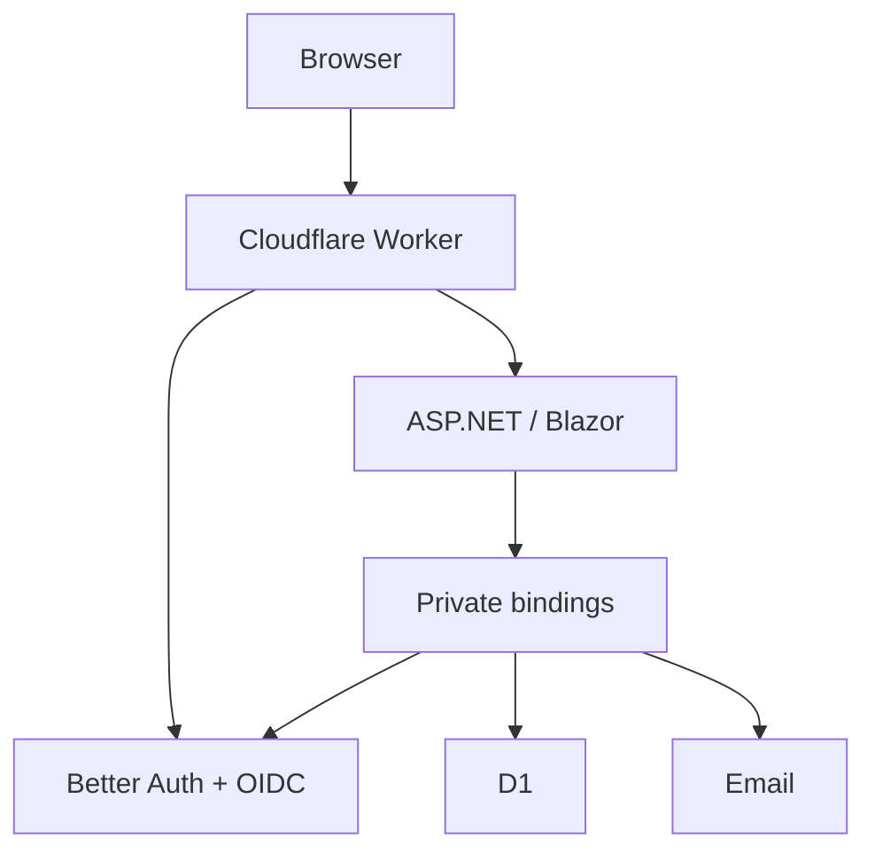

# Flarestack developer overview

Flarestack is a local-first framework and starter for a **.NET 10 Blazor Web App
using Interactive Server rendering**, backed by Cloudflare Workers, D1 and Better
Auth. It is a preview with local validation and an initial Cloudflare deployment.



## 1. Prerequisites and installation

Use .NET SDK **10.0.401**, Bun **1.4.2**, Aspire CLI **13.5.3** and Chromium
(`/usr/bin/chromium`, or set `CHROMIUM_PATH`). Docker is required for Container mode.
With mise installed, tool setup is:

```sh
mise install dotnet@10.0.401 bun@1.4.2
mise use dotnet@10.0.401 bun@1.4.2
dotnet tool install --global Aspire.Cli --version 13.5.3
```

In the Flarestack repository, prepare and install the preview artifacts:

```sh
bun install --frozen-lockfile
bun run prepare:local
dotnet new install ./artifacts/templates/Flarestack.Templates.0.1.0-local.2.nupkg
```

If replacing an installed preview template, first run
`dotnet new uninstall Flarestack.Templates`. Nothing is published to a registry.

## 2. Five-minute quick start

```sh
dotnet new flarestack-blazor -n MyApp -o MyApp
cd MyApp
bun install --frozen-lockfile
dotnet restore
bun run doctor
bun run dev
```

Open the app from Aspire, create an account, and use Aspire's **inbox** endpoint
to verify the email. The starter includes Todo CRUD, recovery, account settings,
session controls and user administration. No default administrator is created.

For another port block, use `bun run configure:local --port 9000`; it checks
conflicts and writes a gitignored machine override. For Container mode, stop the
app and run `Flarestack__LocalMode=Container aspire run`.

## 3. Architecture and ownership

Aspire owns the dashboard, supervisor and Fast-mode .NET watcher. Alchemy alone
owns Workers, D1, migrations, containers and email bindings. Fast mode runs .NET
on the host; Container mode runs the same application in Docker. Both export
logs and connected traces to Aspire, including optional SQL text.

## 4. Public APIs

| Package | Developer-facing API |
| --- | --- |
| `Flarestack.D1` | `AddFlarestackD1`; `ID1Database` query, execute and batch methods |
| `Flarestack.Authentication` | `AddFlarestackAuthentication`; account endpoints; `ICurrentUser`; `IUserAdministration`; `UserRole` |
| `Flarestack.Email` | `AddFlarestackEmail`; `IFlarestackEmailSender`; `EmailMessage`; `EmailSendResult` |
| `Aspire.Hosting.Flarestack` | `AddFlarestack(name, infraDirectory, configure)`; discovers declared package scripts |
| `@flarestack/alchemy` | `FlarestackApp`, `createAuthWorker`, `createEmailWorker` |

See [API examples](public-api.md). All artifacts share one release version and
negotiate an internal protocol before private operations.

## 5. Security model

Better Auth is the session authority. Cookies validate on each ASP.NET request;
existing circuits poll every 30 seconds with a 10-second validation timeout.
`ICurrentUser` rechecks before each repository/admin operation. Failures reject
access. Administration applies an ASP.NET policy and an independent live Worker
check. Bootstrap IDs come from stage configuration, not source.

Raw D1 does not provide row ownership enforcement: use `ICurrentUser` and owner
predicates. See the precise [session/failure model](security-model.md) and
[database guidance](database.md).

## 6. Validation and limits

See the [validation matrix](validation.md) for measured coverage and commands.
Local email is capture-only; initial cloud deployment, custom-domain login and
verification delivery now pass. Full cloud CRUD, recovery and sleep/wake validation
remain pending. Metrics, fuzzy admin search and durable audit
storage are deferred. See [upgrade guidance](upgrading.md) and the
[cloud validation runbook](cloud-preview.md).
